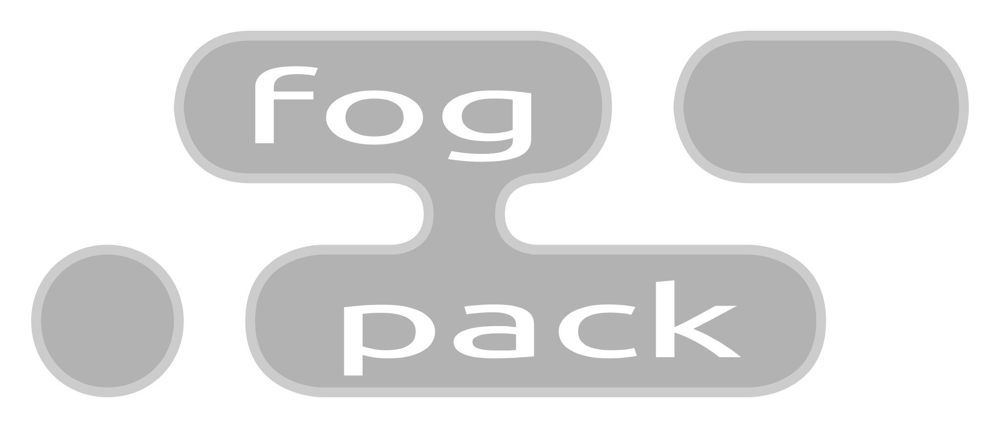

# 

fog-pack builds on msgpack with a set of extensions useful for all structured 
data. The ultimate goal is to provide a single coherent approach to encoding 
data, validating it, and compressing it. Any existing data format can be 
replaced with fog-pack, without compromise.

To meet this lofty goal, it extends msg-pack by providing:

- A canonical form for all data. Given a known input, the same fog-pack value 
	will always be generated
- Cryptographic hashes are a value type, and the hash of a fog-pack value can 
	be calculated
- Encrypted data is a value type, which may contain arbitrary data, a secret 
	key, or a private key
- Support for symmetric-key cryptography
	- Data can be encrypted using a secret key
	- Secret keys may be passed around in encrypted form
- Support for public-key cryptography.
	- Public keys are a value type
	- Data can be signed with a secret key
	- Data can be encrypted with a public key
	- Private keys may be passed around in encrypted form
- A schema format, allowing for validation of fog-pack values
	- Specifies subsets of possible values
	- Schema may be used to filter fog-pack values, allowing them to be used as a 
		query against a database of values
	- Schema are themselves fog-pack objects
- Immutable Documents, consisting of a fog-pack object with an optional schema 
	reference.
- Entries, consisting of a fog-pack object, a key string, and the hash of a 
	fog-pack Document. These may be used to form mutable links between documents.
- Support for compression. A document or entry may be compressed after encoding 
	& hashing. Dictionary compression of values is supported if a schema is used, 
	allowing for exceptionally fast compression and high ratios. See 
	[`zstd`](https://facebook.github.io/zstd/) for more information on the 
	compression used.

## License

Licensed under either of

- Apache License, Version 2.0
	([LICENSE-APACHE](LICENSE-APACHE) or http://www.apache.org/licenses/LICENSE-2.0)
- MIT license
	([LICENSE-MIT](LICENSE-MIT) or http://opensource.org/licenses/MIT)

at your option.

## Contribution

Unless you explicitly state otherwise, any contribution intentionally submitted
for inclusion in the work by you, as defined in the Apache-2.0 license, shall be
dual licensed as above, without any additional terms or conditions.
